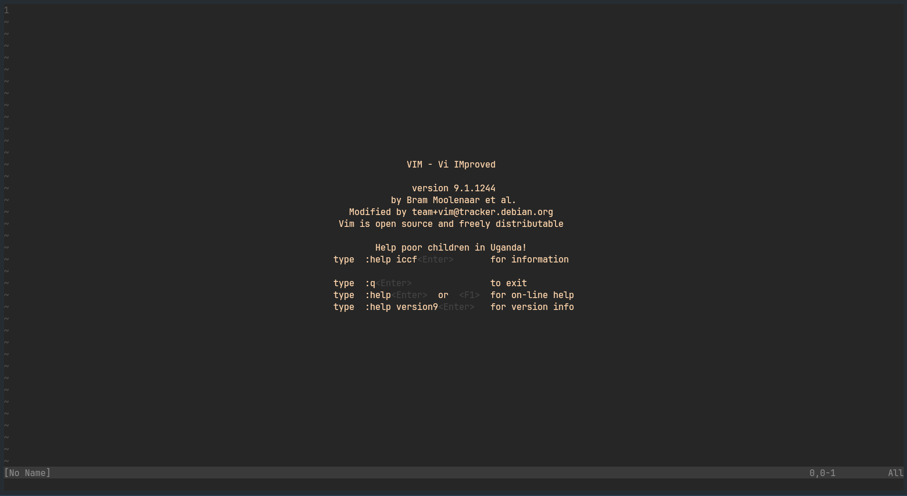
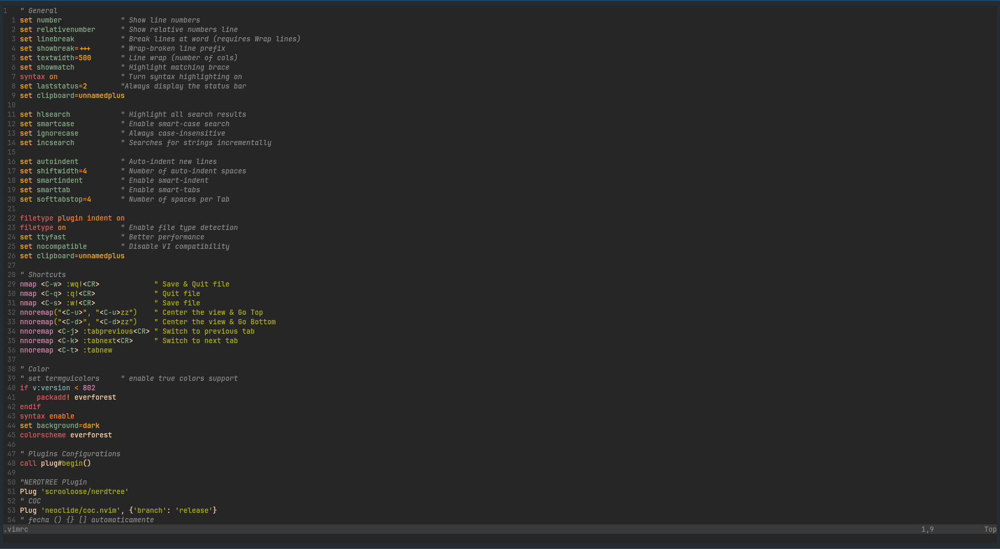

# vimAmbient

---

Um ambiente de desenvolvimento **Vim**, customizado com o tema **Everforest**, autocompletar via LSP (**CoC.nvim**) e atalhos otimizados para compilação em C.

---

## Demonstração do Tema





## Conteúdo do Repositório

- **`.vimrc`**: Arquivo principal de configurações, atalhos e plugins.
- **`.vim/autoload/plug.vim`**: Gerenciador de plugins `vim-plug` integrado.
- **`.vim/colors/everforest.vim`**: Esquema de cores Everforest pré-instalado.
- **`.gitignore`**: Regras de exclusão para arquivos temporários, caches e backups locais do Vim.


## Pré-requisitos

Certifique-se de ter o **Vim 8.2+** e o **Node.js** (necessário para o autocompletar do CoC) instalados no seu sistema:

#### Ubuntu / Debian:
```bash
sudo apt update && sudo apt install vim nodejs npm gcc -y
```
#### Arch Linux:
```bash
sudo pacman -S vim nodejs npm gcc 
```

## Instalação

### 1. Clone o repositório

Clone o repositório e coloque os arquivos na sua pasta $HOME(~).

```bash
git clone https://github.com/im-daxter/vimAmbient.git
```

Copie os arquivos de configuração para a raiz
```bash
cp ~/.vimAmbient/.vimrc ~/.vimrc \
cp -r ~/.vimAmbient/.vim ~/.vim
```

### 2. Instalar os Plugins

Abra o Vim no terminal e rode o comando de instalação do **vim-plug**:

```bash
:PlugInstall
```

Nota para o CoC.nvim: Na primeira inicialização, você pode instalar extensões de linguagem executando dentro do Vim:
```bash
:CocInstall coc-clangd coc-json coc-python
```

## Plugins utilizados

| Plugin        | Repositório          | Descrição                                                           |
| :-----------: |:-------------------: | :-----------------------------------------------------------------: |
| NerdTree      | preservim/nerdtree   | Navegador e árvore de arquivos.                                     |
| CoC.nvim      | neoclide/coc.nvim    | Engine de autocompletar e suporte a LSP (Language Server Protocol). |
| Auto-Pairs    | jiangmiao/auto-pairs | Fechamento automático de parênteses (), chaves {} e colchetes [].   |
| Everforest    | sainnhe/everforest   | Tema de cores everforest.                                           |

## Atalhos de Teclado

### Salvamento

+ <kbd>Ctrl+s</kbd> : Salva o arquivo atual (:w!).
+ <kbd>Ctrl+q</kbd>: Sai sem salvar (:q!).
+ <kbd>Ctrl+w</kbd>: Salva e fecha o arquivo (:wq!).
+ <kbd>Ctrl+n</kbd>: Abre/Fecha a árvore do **NERDTree**.

### Navegação de abas e janelas

+ <kbd>Ctrl+t</kbd>: Abre uma nova aba (:tabnew).
+ <kbd>Ctrl+j</kbd>: Muda para a aba anterior (:tabprevious).
+ <kbd>Ctrl+k</kbd>: Muda para a próxima aba (:tabnext).
+ <kbd>Ctrl+u</kbd>: Rola meia página para cima e centraliza a visão (zz).
+ <kbd>Ctrl+d</kbd>: Rola meia página para baixo e centraliza a visão (zz).

### Autocomplete (CoC)

+ <kbd>Tab</kbd> / <kbd>Shift+Tab</kbd>: : Navega para baixo/cima no menu de sugestões.
+ <kbd>Enter</kbd>: Confirma a sugestão selecionada.

### Compilação automática (Linguagem C)

| Tecla         | Comando                          | Descrição/Uso                        |
| :-----------: |:-------------------------------: |:-----------------------------------: |
| <kbd>F5</kbd> | <kbd>gcc % -o %< && ./%<</kbd>   | Compilação padrão e execução rápida. |


